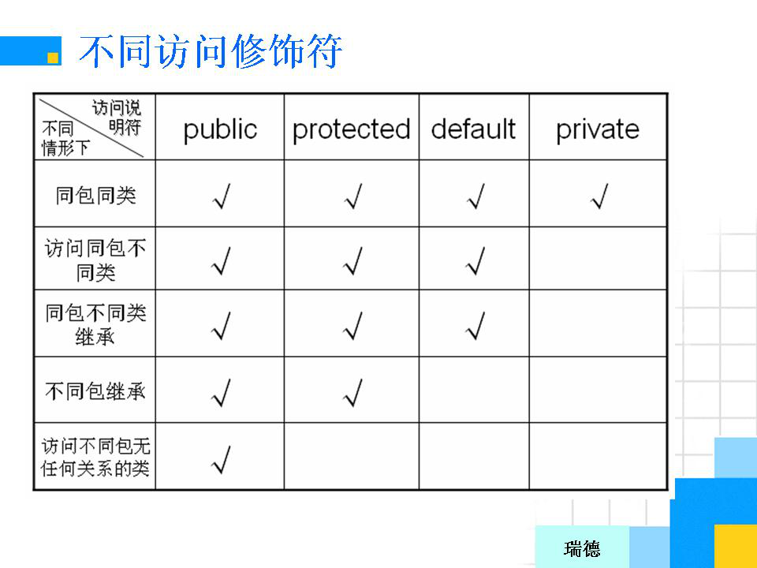

## java访问修饰符
### 一，java访问修饰符

#### (一)public
>* 定义为public的class、interface可以被其他任何类访问：
>* 定义为public的field、method可以被其他类访问，前提是首先有访问class的权限。
##### 示例
~~~java
//in package abc
package abc;
public class Hello {
    public void hi() {
    }
}
//in package xyz
package xyz;
class Main {
    void foo() {
        // Main可以访问Hello
        Hello h = new Hello();
    }
}
~~~

#### （二）protect
>* protected作用于继承关系。定义为protected的字段和方法可以被子类访问，以及子类的子类访问。
>* 子类可访问不同包之间有继承关系的父类中有protected修饰的field和method。
##### 示例
~~~java
package abc;
public class Hello {
    // protected方法:
    protected void hi() {
    }
}

package xyz;
class Main extends Hello {
    void foo() {
        // 可以访问protected方法:
        hi();
    }
}
~~~

#### （三）private
>* private修饰的field和method不允许被其他类访问。
##### 示例
~~~java
public class Main {
    public static void main(String[] args) {
        Person ming = new Person();
        ming.setBirth(2008);
        System.out.println(ming.getAge());
    }
}

class Person {
    private String name;
    private int birth;

    public void setBirth(int birth) {
        this.birth = birth;
    }

    public int getAge() {
        return calcAge(2019); // 调用private方法
    }

    // private方法:
    private int calcAge(int currentYear) {
        return currentYear - this.birth;
    }
}
~~~

#### （四）package
>* 包作用域是指一个类允许访问同一个package的没有public、private修饰的class，以及没有public、protected、private修饰的字段和方法。
>* 只要在同一个包，就可以访问package权限的class、field和method。
##### 示例
~~~java
package abc;
// package权限的类:
class Hello {
    // package权限的方法:
    void hi() {
    }
}

package abc;
class Main {
    void foo() {
        // 可以访问package权限的类:
        Hello h = new Hello();
        // 可以调用package权限的方法:
        h.hi();
    }
}
~~~

#### （五）局部变量
>* 在方法内部定义的变量称为局部变量，局部变量作用域从变量声明处开始到对应的块结束。方法参数也是局部变量。
##### 示例
~~~java
package abc;
public class Hello {
    void hi(String name) { // ①
        String s = name.toLowerCase(); // ②
        int len = s.length(); // ③
        if (len < 10) { // ④
            int p = 10 - len; // ⑤
            for (int i=0; i<10; i++) { // ⑥
                System.out.println(); // ⑦
            } // ⑧
        } // ⑨
    } // ⑩
}
~~~

#### （六）final
>* 用final修饰class可以阻止被继承。
>* 用final修饰method可以阻止被子类覆写。
>* 用final修饰field可以阻止被重新赋值。
>* 用final修饰局部变量可以阻止被重新赋值。
##### 示例
~~~java
package abc;

// final修饰class可以阻止被继承。
public final class Hello {
    private int n = 0;
    protected void hi(int t) {
        long i = t;
    }
}

//用final修饰method可以阻止被子类覆写。
package abc;
public class Hello {
    protected final void hi() {
    }
}

//用final修饰field可以阻止被重新赋值。
package abc;
public class Hello {
    private final int n = 0;
    protected void hi() {
        this.n = 1; // error!
    }
}

//final修饰局部变量可以阻止被重新赋值。
package abc;
public class Hello {
    protected void hi(final int t) {
        t = 1; // error!
    }
}
~~~
#### （七）总结
* protected修饰符所修饰的类（这句话中指父类）属成员变量和方法，只可以被子类访问，而不管子类是不是和父类位于同一个包中。protected属于子类限制修饰符。
* default修饰符所修饰的类属成员变量和方法，只可被同一个包中的其他类访问，而不管其他类是不是该类的子类。default属于包限制修饰符。